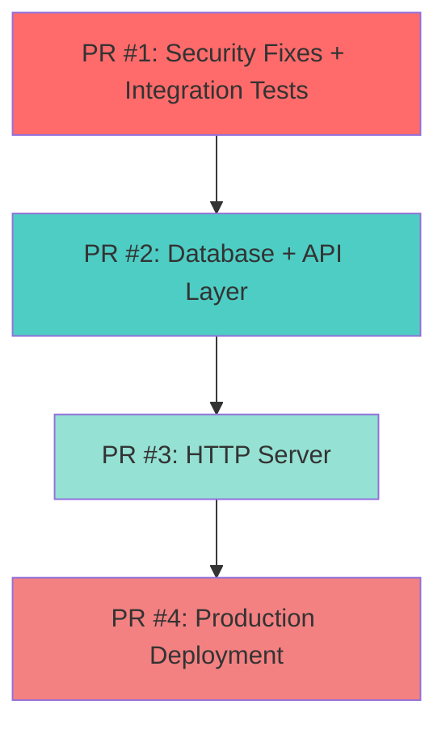

# Pull Request Strategy Summary

## Quick Reference

This document provides a high-level overview of the proposed PRs for the verifier proxy work. Updated to include all 31 commits.

---

## 🚨 Priority 1: CRITICAL SECURITY FIX + INTEGRATION TESTS

### PR #1: Security Fixes + Integration Test Suite
**Branch:** `feat/integration-tests-security-fixes`  
**Urgency:** HIGH PRIORITY  
**Size:** 6 files (~1,300 lines test code, ~500 lines fixes, 1 doc)  
**Reviewers:** @security-team @qa-team @architecture-team

**What:**
Integration test suite that discovered 2 production bugs + fixes for those bugs.

**Why Combined:**
- Integration tests discovered the bugs
- Fixes validate that tests now pass
- Logical unit: test discovery → fix → verify
- Tests provide immediate validation of security fixes

**Commits (Series 1-2 + Formatting):**
1. feat: Add integration test infrastructure (suite.go, helpers.go, testing.go, STATUS.md)
2. test: Add integration test scenarios (flows_test.go - 5 scenarios, 8 tests)
3. fix: Prevent authorization code replay attacks (SECURITY - handler_oidc.go)
4. fix: Use configured durations for sessions/tokens (handler_api.go, handler_oidc.go)
5. docs: Document integration test bug discoveries (BUG_FIXES.md)
25. style: Fix test file formatting (whitespace/alignment cleanup)

**Security Impact:**
- ✅ Authorization code replay vulnerability FIXED
- ✅ Configurable durations implemented
- ✅ All tests passing (8/8)

**Testing:**
- 5 integration test scenarios with real MongoDB
- Runtime: ~8 seconds
- Test: `TestIntegration_CodeReplayPrevention` validates fix
- Test: `TestIntegration_SessionExpiration` validates configurable durations

**Merge:** Should be merged FIRST - provides foundation and security fixes

---

## 🎯 Priority 2: Core Functionality & API Layer

### PR #2: Database + API Layer Implementation
**Branch:** `feat/database-api-layer`  
**Size:** 8 files (~1,400 lines production code, ~1,600 lines tests)  
**Reviewers:** @backend-team @database-team @identity-team

**What:**
Complete database persistence layer + API client with comprehensive unit tests.

**Key Features:**
- MongoDB-backed session/client persistence
- API client with TTL caches for encryption keys and request objects
- OpenID4VP request object generation
- Mock database for fast unit testing
- 30+ unit tests across all components

**Commits (Series 3-4 + Configuration & Dependencies):**
6. feat: Add database layer for OIDC sessions (db.go, session.go, client.go)
7. test: Add database model tests (models_test.go)
8. feat: Add OpenID4VP request object generation (handler_openid4vp.go)
9. test: Add API handler tests (3 test files - OIDC, OpenID4VP, helpers)
10. test: Add mock database for unit tests (mock_db_test.go)
11. feat: Add error definitions and health endpoint (handlers.go)
17. feat: Add API client implementation (client.go - 133 lines)
18. test: Add API client unit tests (client_test.go, client_constructor_test.go - 651 lines)
19. test: Add metadata and authorization handler tests (2 files - 728 lines)
20. test: Add ID token handler tests (handler_idtoken_test.go - 345 lines)
24. build: Update dependencies for integration tests (testcontainers-go, gotest.tools)
26. feat: Add verifier-proxy configuration models (config.go structs)
27. feat: Add PKCE validation function (ValidatePKCE)

**Test Coverage:**
- Database operations (sessions, clients, atomic updates)
- API client initialization and lifecycle
- OIDC metadata and JWKS endpoints
- Authorization flow with PKCE
- Token exchange (authorization_code, refresh_token)
- UserInfo endpoint with Bearer auth
- OpenID4VP request object generation

**Dependencies:** None  
**Blocks:** HTTP Server

---

## 🌐 Priority 3: HTTP Server & User Interface

### PR #3: HTTP Server and Endpoints
**Branch:** `feat/http-server`  
**Size:** 5 files (~700 lines production code, 1 HTML template)  
**Reviewers:** @frontend-team @backend-team

**What:**
Complete HTTP server with OIDC, OpenID4VP, and UI endpoints.

**Key Features:**
- OIDC endpoints (authorize, token, userinfo, discovery, JWKS)
- OpenID4VP endpoints (request object, direct_post, callback)
- UI endpoints (QR code display, status polling)
- Modern responsive authorization page with JavaScript polling
- Gin-based HTTP server with proper error handling

**Commits (Series 5):**
12. feat: Add HTTP server infrastructure (service.go)
13. feat: Add OIDC endpoint handlers (endpoints_oidc.go)
14. feat: Add OpenID4VP endpoint handlers (endpoints_openid4vp.go)
15. feat: Add UI endpoint handlers (endpoints_ui.go)
16. feat: Add authorization page template (static/authorize.html)

**User-Facing Features:**
- QR code generation for wallet scanning
- Real-time session status polling
- OAuth 2.0 compliant error responses
- Proper HTTP headers (Cache-Control, WWW-Authenticate)
- Mobile-responsive UI

**Dependencies:** Database Layer, API Layer (PR #2)  
**Blocks:** None (completes user-facing functionality)

---

## 🚀 Priority 4: Production Deployment

### PR #4: Production Service + Deployment Automation
**Branch:** `feat/production-deployment`  
**Size:** 11 files (~1,900 lines including scripts, docs, config, docker)  
**Reviewers:** @devops-team @backend-team @architecture-team

**What:**
Main service entry point, bootstrapping automation, and comprehensive documentation for production deployment.

**Key Features:**
- Production-ready main.go with graceful shutdown
- MongoDB initialization scripts
- OAuth client registration automation
- Docker Compose integration
- Comprehensive deployment documentation

**Commits (Series 6 - Production + Build):**
21. feat: Add main service entry point (cmd/verifier-proxy/main.go - 85 lines)
    - Service orchestration (DB, API, HTTP server)
    - Graceful shutdown (SIGTERM/SIGINT)
    - Configuration, logging, tracing integration
    
22. feat: Add bootstrapping scripts and documentation (5 files - 780 lines)
    - bootstrap.sh - Master setup orchestration
    - init_mongodb.sh - Database/collection initialization
    - register_clients.sh - OAuth client registration
    - README.md - Setup and deployment guide
    - DOCKER_INTEGRATION.md - Container orchestration
    
23. docs: Add comprehensive service documentation (docs/verifier-proxy/README.md - 457 lines)
    - Architecture overview
    - API reference (all endpoints)
    - Configuration guide
    - Deployment procedures
    - Security best practices
    - Troubleshooting guide

28. build: Add verifier-proxy build targets (Makefile)
29. feat: Add verifier-proxy production configuration (config.yaml)
30. test: Update credential validity dates in test data (bootstrapping/*.json)
31. feat: Add verifier-proxy service to docker-compose (docker-compose.yaml)

**Deployment Capabilities:**
- Local development setup (< 5 minutes)
- Docker Compose deployment
- CI/CD pipeline integration
- Production deployment automation
- Environment bootstrapping

**Dependencies:** All previous PRs (integrates everything)  
**Blocks:** None (final piece)

---

## Recommended Merge Order



**Detailed Flow:**

```
┌──────────────────────────────────────────────┐
│ PR #1: Security + Integration Tests (5)     │ ← Merge FIRST
│ • Critical security fixes                   │   (Commits 1-5)
│ • Integration test foundation               │
│ • Bug documentation                         │
└──────────────────────────────────────────────┘
                    ↓
┌──────────────────────────────────────────────┐
│ PR #2: Database + API Layer (12)            │ ← Merge SECOND
│ • MongoDB persistence                       │   (Commits 6-11, 17-20)
│ • API client implementation                 │
│ • OpenID4VP support                         │
│ • Comprehensive unit tests                  │
└──────────────────────────────────────────────┘
                    ↓
┌──────────────────────────────────────────────┐
│ PR #3: HTTP Server (5)                      │ ← Merge THIRD
│ • All OIDC/OpenID4VP endpoints              │   (Commits 12-16)
│ • UI with QR code display                   │
│ • User-facing complete                      │
└──────────────────────────────────────────────┘
                    ↓
┌──────────────────────────────────────────────┐
│ PR #4: Production Deployment (3)            │ ← Merge LAST
│ • Main service entry point                  │   (Commits 21-23)
│ • Bootstrapping automation                  │
│ • Deployment documentation                  │
└──────────────────────────────────────────────┘
```

**Why This Order:**

1. **PR #1 First**: Security fixes are critical and integration tests validate everything
2. **PR #2 Second**: Foundation layer required by HTTP server
3. **PR #3 Third**: Completes core functionality, user-facing features ready
4. **PR #4 Last**: Deployment automation and documentation (optional but recommended)

---

## Statistics

### Total Changes (31 Commits)

- **New files:** 38+
- **Lines of code:** ~66,100+ (including vendor, tests, docs, config)
- **Production code:** ~3,600 lines
- **Test code:** ~4,500 lines
  - Integration tests: ~1,300 lines
  - Unit tests: ~3,200 lines
- **Documentation:** ~1,500 lines
- **Scripts & Automation:** ~300 lines
- **Configuration & Build:** ~150 lines

### Test Coverage

- **Integration tests:** 5 scenarios, 8 total test cases
- **Unit tests:** 40+ test functions
  - Database layer: 10+ tests
  - API handlers: 15+ tests
  - Client lifecycle: 5+ tests
  - Metadata/Authorization: 7+ tests
  - Token/UserInfo: 10+ tests
- **Test runtime:** ~8 seconds (full integration suite)
- **Bug discoveries:** 2 production bugs (both fixed)

### Security Impact

- **Critical vulnerability fixed:** Authorization code replay
- **Configuration improvements:** Hardcoded durations now configurable
- **Standards compliance:** OAuth 2.0 RFC 6749, OpenID4VP spec
- **PKCE enforcement:** S256 code challenge validation with dedicated function

### PR Breakdown

| PR | Commits | Files | Lines | Focus |
|----|---------|-------|-------|-------|
| #1 | 6 (1-5, 25) | 6 | ~1,800 | Security + Integration Tests + Formatting |
| #2 | 13 (6-11, 17-20, 24, 26-27) | 17 | ~3,200 | Database + API + Dependencies + Config |
| #3 | 5 (12-16) | 5 | ~1,200 | HTTP Server + UI |
| #4 | 7 (21-23, 28-31) | 11 | ~1,900 | Production + Build + Docker |
| **Total** | **31** | **39** | **~8,100** | **Complete Service** |
| **Total** | **23** | **32** | **~7,400** | **Complete Service** |

---

## Alternative Strategy: Consolidated PRs

If your team prefers fewer, larger PRs:

## Alternative Strategy: Consolidated PRs

If your team prefers fewer, larger PRs:

### Option A: Two-PR Strategy (Recommended for Fast Merge)

**PR #1: Complete Implementation** (Commits 1-20)
- All security fixes, database, API, HTTP server, and tests
- ~6,000 lines across all layers
- Everything needed for production
- Reviewers: All teams
- **Pros:** Single review cycle, fast to production
- **Cons:** Large PR, harder to review thoroughly

**PR #2: Deployment Automation** (Commits 21-23)
- Main entry point, scripts, documentation
- ~1,400 lines
- Optional but recommended
- Reviewers: DevOps team
- **Pros:** Can merge after service is running
- **Cons:** None

### Option B: Three-PR Strategy (Balanced)

**PR #1: Foundation** (Commits 1-11)
- Integration tests, security fixes, database, core API
- ~3,500 lines
- Reviewers: Backend + Security teams
- **Includes:** All critical security fixes + validation

**PR #2: Service Layer** (Commits 12-20)
- HTTP server, endpoints, additional unit tests
- ~2,500 lines
- Reviewers: Backend + Frontend teams
- **Includes:** Complete user-facing functionality

**PR #3: Production** (Commits 21-23)
- Deployment automation and documentation
- ~1,400 lines
- Reviewers: DevOps team
- **Includes:** Everything needed for deployment

### Option C: Current Four-PR Strategy (Recommended)

See above for detailed breakdown. **Best for:**
- Thorough code review
- Independent team review cycles
- Incremental merging with validation
- Clear separation of concerns

---

## Creating the PRs

### Commands for Four-PR Strategy

**PR #1: Security Fixes + Integration Tests**

```bash
git checkout -b feat/integration-tests-security-fixes main
git cherry-pick e564ebb5 6c9740b9 e74f8f16 3cc49b07 119062d6 5be0c605
git push origin feat/integration-tests-security-fixes
# Open PR with title: "Security Fixes + Integration Test Suite"
```

**PR #2: Database + API Layer**

```bash
git checkout -b feat/database-api-layer main
git cherry-pick e47751db 1c7cd299 84cf69d7 c37e5e7b 7e3e83e7 ea220a6b \
               d1f05511 9f72e47a ace37c7c f0844b47 \
               066ce547 3de24ba8 205454c1
git push origin feat/database-api-layer
# Open PR with title: "Database + API Layer Implementation"
```

**PR #3: HTTP Server**

```bash
git checkout -b feat/http-server main
git cherry-pick f9f9ab8e a993a884 e336caf8 6cd93e02 083d3999
git push origin feat/http-server
# Open PR with title: "HTTP Server and Endpoints"
```

**PR #4: Production Deployment**

```bash
git checkout -b feat/production-deployment main
git cherry-pick 0f41d09c e8c706e8 6ae8488e b44533ec 9f0c7bec bd56f1a7 3545b746
git push origin feat/production-deployment
# Open PR with title: "Production Service + Deployment Automation"
```

### PR Dependencies

```
PR #1 (Independent) ─────────────────┐
                                     ↓
                            PR #2 (Depends on #1)
                                     ↓
                            PR #3 (Depends on #2)
                                     ↓
                            PR #4 (Depends on #3)
```

**Note:** PRs #2, #3, and #4 should be created immediately but only merged after their dependencies.

---

## Next Steps

1. **Review this strategy** with your team
2. **Choose PR approach:**
   - Four-PR strategy (recommended for thorough review)
   - Three-PR strategy (balanced)
   - Two-PR strategy (fastest to production)
3. **Create branches** using commands above
4. **Open PR #1 immediately** (security fixes are critical)
5. **Open remaining PRs** for review queue
6. **Schedule reviews** with appropriate teams
7. **Merge incrementally** following dependency chain

---

## Review Guidelines

### PR #1 Review Checklist
- [ ] Integration tests pass locally
- [ ] Security fix prevents code replay (test included)
- [ ] Configurable durations work correctly
- [ ] Test coverage is comprehensive
- [ ] Documentation explains bug fixes clearly

### PR #2 Review Checklist
- [ ] Database operations are atomic and safe
- [ ] API client caches work correctly (TTL validation)
- [ ] Unit tests cover edge cases
- [ ] Mock database matches real interface
- [ ] OpenID4VP request objects are spec-compliant

### PR #3 Review Checklist
- [ ] All OIDC endpoints follow OAuth 2.0 spec
- [ ] Error responses use correct HTTP status codes
- [ ] UI is responsive and accessible
- [ ] QR code generation works
- [ ] Status polling doesn't overload server

### PR #4 Review Checklist
- [ ] Graceful shutdown works correctly
- [ ] Bootstrap scripts are idempotent
- [ ] Documentation is clear and complete
- [ ] Docker Compose setup tested
- [ ] Environment variables documented

---

## Questions?

See `COMMIT_PLAN.md` for:

- Detailed commit messages for all 23 commits
- Full file lists per commit
- Commit series organization
- Before/after code examples for bug fixes

---

## Summary

**Status:** ✅ Ready to create PRs  
**Total Commits:** 31  
**Total PRs:** 4 (recommended) or 2-3 (alternatives available)  
**Blockers:** None  
**Estimated Review Time:** 2-3 days per PR

**Key Highlights:**

- 🔒 Critical security fixes included in PR #1
- ✅ 40+ unit tests + 8 integration tests
- 📚 Comprehensive documentation
- 🚀 Production-ready deployment automation
- 🔧 Complete build and configuration infrastructure
- 🐳 Docker Compose integration for local development
- 📊 ~8,100 lines of new code across 39 files

**Ready for:** Branch creation and PR submission

---

*Last Updated: November 15, 2025*  
*Total Commits: 31*  
*PR Strategy: Four-PR incremental merge (recommended)*

