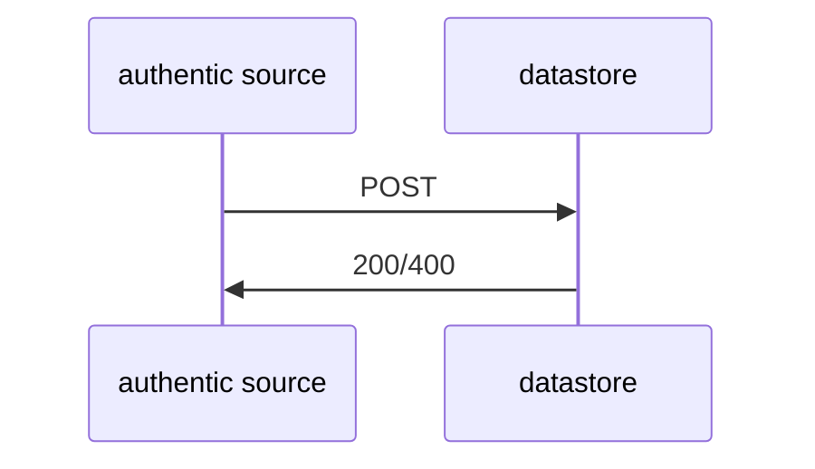
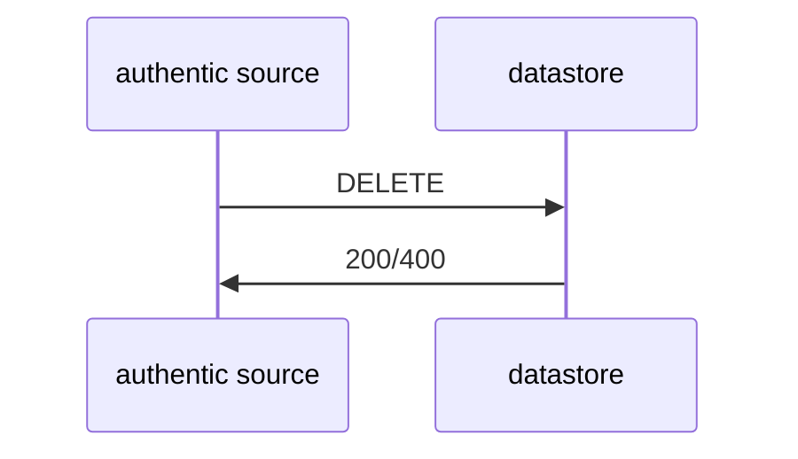
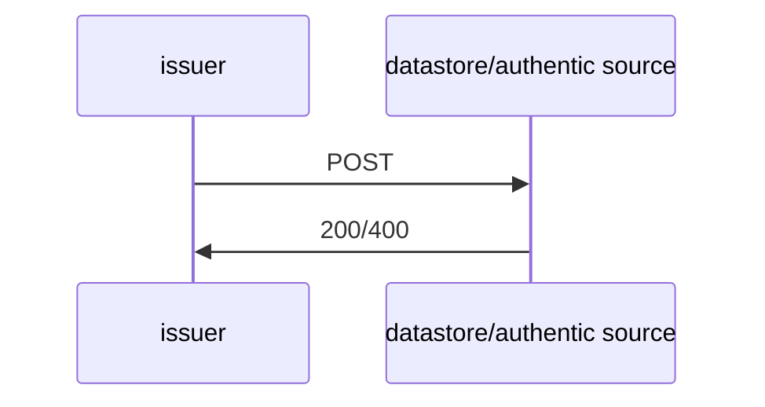
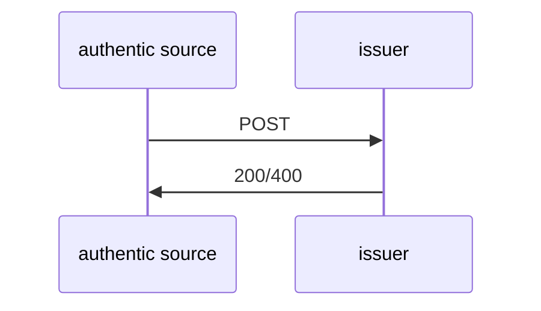

# Datastore Rest API

## Version

    APIv2.1 - revision 1 

## POST /upload

### Flowchart



### Description

The Process starts with the authentic source which is uploading all relevant data to the Datastore. All steps regarding the general application of an attestation are out of scope and reside to the internal processes of the authentic source.

The data upload consist of four objects used as input for the call. These are `meta`, `identity`, `attestation` and `document_data`.

First, the meta object consists of the authentic source ID, document type and document ID. These act as the main identifier in the Datastore. One document ID is valid and unique per document type and authentic source ID. Another required input is the institutional identifier of the person to ensure flexibility in identification and reduce susceptibility to errors. Again, this may also be valid and unique only in the domain of the authentic source. Therefore, in order to match an institutional person ID
(authentic_source_person_id) a filter by authentic source ID needs to be applied before a selection
operation is done. Finally, the meta object has defined revocation and collect ID as optional
parameters. They may be set by the authentic source for special use cases and preferences. If not
defined by the upload they shall be set equal to the document ID by the Datastore System.

Second object is identity data which includes equal to the current definition of the PID, all possible
parameters optional and required concerning the subject of the attestation to be uploaded. This is
the first approach to handle the identity matching topic. An authentic Source shall upload all
available information concerning the defined attributes. The more the better for later matching, against a PID from an EUDIW.

Third there is an attestation data object defined. This object contains attributes that shall be used for
display in a portal solution. Since there are many different credential types and relevant information
to display may differ, it was decided to define this as a generic object containing a short and long text
which can be filled by choice of the authentic source with relevant display information. In addition,
valid from and valid to information of the attestation, shall be provided by default.

Finally, the document data object needs to be submitted. We expect a JSON electronic document containing all business decision data matching to the document type and schema definitions.

### Request

```json
{
    "meta": {
        "authentic_source": "",
        "document_id": "",
        "document_type": "",
        "authentic_source_person_id": "",
        "uuid": "", 
        "revocation_id": "",
        "document_id": "",
        "collect_id": "",
        "document_version": 0,
    },
    "identity": {
        "identity_version": "",
        "family_name": "",
        "given_name":"",
        "birth_date":"",
        "uuid": "",
        "family_name_birth":"",
        "given_name_birth":"", 
        "birth_place":"",
        "gender":"",
        "age_over_18":"",
        "age_over_NN":"",
        "age_in_years":"",
        "age_birth_year":"",
        "birth_country":"",
        "birth_state":"",
        "birth_city":"",
        "resident_address":"",
        "resident_country":"",
        "resident_state":"",
        "resident_city":"",
        "resident_postal_code":"", 
        "resident_street":"",
        "resident_house_number":"",
        "nationality":""
    },
    "attestation": {
        "attestation_version": 0,
        "attestation_type": "",
        "description_short": "",
        "description_long": "",
        "valid_from": "",
        "valid_to":""
        },  
    "document_data": {}
}
```

### Response

http OK 200, else 400 and error body

## POST /notification

### Flowchart


### Description

After the upload was successful the authentic source can call the get notification endpoint, to receive QR code and `deep_link` to include them in existing notification means. This is split from the upload endpoint to allow fast mass uploads of documents and to allow openness for different system architectures as this information request may be done by a different authentic source component as the upload.

As explained before the three attributes used for unequivocal selection of an entry are required as input. These are authentic source ID, document type and document ID. A selection/ filter in the Datastore must be executed in this order.

After identifying the respective entry in the Data Store database, the data store must generate a pickup link based on the collection ID. Note that this may be equal to the document ID if not further defined. The link should ultimately be formatted as a QR code, and both the link and QR code should be returned to the Authentic Source.

Link and QR code can be encoded according to the OID4VCI protocol with collection/document ID reference. However, as sharing of the PID by the EUDIW user is expected, it may be more practical to encode the link and QR code according to the OID4VP protocol and initiate it directly with the request for the credential. It is anticipated that both protocols may be utilized for functionality in presentation and subsequent issuance, and an efficient technical implementation for this purpose is yet to be devised. For the link to be created a specific endpoint needs to be known to the data store which points to the Issuer System and can serve issuance requests by the EUDIW. It shall be possible to define this in a Data Store config file/ properties.

After the QR code and link are received the authentic source may follow existing protocols and channels to notify the subject of the credential.

### Request

```json
{
    "authentic_source": "",
    "document_type": "",
    "document_id": "",
}
```

### Response

```json
{
    "data": {
        "base64_image": "",
        "deep_link": ""
    }
}
```

http OK 200, else 400 and error body

## DELETE /document

### Flowchart



### Description

Delete one document

### Request

```json
{
    "authentic_source": "",
    "document_id": ""
}
```

### Response

http OK 200, else 400 and error body

## POST /document/attestation

### Flowchart



### Description

The Data Store should now have an endpoint with these parameters as input to return the
corresponding attestation data to the Issuer System.

This endpoint should only return the attestation data if there is a unique match for the institutional identity; otherwise, an error message should be reported. Again, mapping is done by matching the `identity` information provided by the
authentic source and included in the Datastore database against the information provided in the PID.

The `collect_id` is used to identify the correct attestation. The attestation data gets returned after a single match was found, which can now be processed by the Generic Issuer System to create a VC.

### Request

```json
{
    "authentic_source": "",
    "collect_id":"",
    "identity": {
        "identity_version": "",
        "family_name": "",
        "given_name":"",
        "birth_date":"",
        "uuid": "",
        "family_name_birth":"",
        "given_name_birth":"", 
        "birth_place":"",
        "gender":"",
        "age_over_18":"",
        "age_over_NN":"",
        "age_in_years":"",
        "age_birth_year":"",
        "birth_country":"",
        "birth_state":"",
        "birth_city":"",
        "resident_address":"",
        "resident_country":"",
        "resident_state":"",
        "resident_city":"",
        "resident_postal_code":"", 
        "resident_street":"",
        "resident_house_number":"",
        "nationality":""
    },
}
```

### Response

```json
{
    "document_data":"",
    "meta": {
        "authentic_source": "",
        "document_id": "",
        "document_type": "",
        "revocation_id": "",
        "document_id": "",
        "collect_id": "",
    },
}

```

http OK 200, else 400 and error body

## POST /portal

### Flowchart


### Description

This endpoint shall be used to get all available attestations (-data) that are stored in the Datastore for a specific person identified by domain specific ID e.g., Social Security Number. The Response Data includes all document information relevant for display in the national portal including `base64_image` and `deep_link`.

Additional to the `authentic_source_id` and `authentic_source_person_id` the optional `validityt_before` and `validity_after` parameter is envisioned as additional input. It can be used by the portal request to limit the response of attestations to such that are valid after or during a specific date. In the response are expected relevant metadata per attestation such as `document_type` and `document_id` as well as the `attestation_data`, which is to be used for display information.
Finally, QR-code and Deeplink are also included in the response per attestation in order for the
citizen to initiate the pickup with his/her EUDIW.

### Request

```json
{
    "authentic_source_id":"", 
    "authentic_source_person_id":"",
    "validity_before": "",
    "validity_after": "",
}
```

### Response

```json
{
    "data": {
        "attestations": [
            {
                "document_type": "",
                "document_id": "",
                "collect_id": "",
                "attestation_data": {
                    "version": 0,
                    "type": "",
                    "description_short": "",
                    "description_long": "",
                    "valid_from": "",
                    "valid_to": ""
                },
                "qr": {
                    "base64_image": "",
                    "deep_link": ""
                }
            }
        ]
    }
}
```

http OK 200, else 400 and error body

## POST /document

### Flowchart


### Request

```json
{
"authentic_source": "",
"document_type": "",
"document_id": ""
}
```

### Response

```json
{
    "data": {
        "document_data":"",
        "meta": {
            "authentic_source": "",
            "document_id": "",
            "document_type": "",
            "uuid": "",
            "revocation_id": "",
            "document_id": "",
            "collect_id": "",
            "authentic_source_person_id": "",
            "document_version": 0
        },
    }
}

```

http OK 200, else 400 and error body

## POST /id/mapping

### Flowchart


### Description

Input consists of `authentic_source_id` and `identity` object with the information of the received PID. It shall return `authentic_source_person_id` if an uniq match was found.

### Request

```json
{
    "authentic_source_id":"",
    "identity": {
        "identity_version": "",
        "family_name": "",
        "given_name":"",
        "birth_date":"",
        "uuid": "",
        "family_name_birth":"",
        "given_name_birth":"", 
        "birth_place":"",
        "gender":"",
        "age_over_18":"",
        "age_over_NN":"",
        "age_in_years":"",
        "age_birth_year":"",
        "birth_country":"",
        "birth_state":"",
        "birth_city":"",
        "resident_address":"",
        "resident_country":"",
        "resident_state":"",
        "resident_city":"",
        "resident_postal_code":"", 
        "resident_street":"",
        "resident_house_number":"",
        "nationality":""
    },
}

```

### Response

```json
{
    "data": {
        "authentic_source_person_id":""
    }
}

```

http OK 200, else 400 and error body

## POST /revoke

### Flowchart



### Description

To clarify the revocation system, it should be known that the `uid` is set by the authentic
source. Usually this will be the same as the document ID, but depending on the use case and the
intention of the authentic source it is possible that two credentials point to the same `uid`.

In order for the Issuer System to select the correct revocation entry in the registry, `authentic_source`, `document_type` and `uid` must be submitted as input from the authentic source. The Issuer system should have internally set the endpoint for the revocation registry. It must be able to configure this in the config/ properties. Additional inputs are revocation status and datetime.

Revocation status allows flexibility for future decisions and flows. One possibility could be to include the `collect_code` for a follow up credential, which may be interpreted by the EUDIW to automatically establish a new pickup flow to get the new credential version. This is to be further decided. Datetime input can be set to define a specific date and time in the future to which the credential shall be defined as revoked. The endpoint responds with a simple status code with information about the operation status and error log if occurring.

### Request

```json
{
    "authentic_source":"",
    "document_type":"",
    "uid":"" ,
    "reference":"",
    "datetime":""
}
```

### Response

http OK 200, else 400 and error body

## Types

### meta{}

|type| Attribute | required | description |
|-|-|-|-|
| string | authentic_source             | true | the issuer agency or institution |
| string | document_id                  | true | uniq identifier within `authentic_source` namespace |
| string | document_type                | true | Type of Document, for example “EHIC” or “PDA1” |
| string | uuid                         | true | uniq identifier within `authentic_source` and `document_type`, generated in authentic source|
| string | revocation_id                | true | uniq identifier within `authentic_source` namespace OR equal to `document_id`|
| string | collect_id                   | false | uniq identifier within `authentic_source` namespace OR equal to `document_id`|
| string | authentic_source_person_id   | true | uniq identifier within `authentic_source` namespace AND globally uniq within authentic source.|
| integer | document_data_version       | true | must be > 0 |

### identity{}

|type| Attribute | required | description |
|-|-|-|-|
| integer | version                 | true  | Version of this identity    |
| string | family_name              | true  | As in current PID namespace  |
| string | given_name               | true  | As in current PID namespace |
| string | birth_date               | true  | As in current PID namespace |
| string | uuid                     | true  | As in current PID namespace |
| string | family_name_birth        | false | As in current PID namespace |
| string | given_name_birth         | false | As in current PID namespace |
| string | birth_place              | false | As in current PID namespace |
| string | gender                   | false | As in current PID namespace |
| string | age_over_18              | false | As in current PID namespace |
| string | age_over_NN              | false | As in current PID namespace |
| string | age_in_years             | false | As in current PID namespace |
| string | age_birth_year           | false | As in current PID namespace |
| string | birth_country            | false | As in current PID namespace |
| string | birth_state              | false | As in current PID namespace |
| string | birth_city               | false | As in current PID namespace |
| string | resident_address         | false | As in current PID namespace |
| string | resident_country         | false | As in current PID namespace |
| string | resident_state           | false | As in current PID namespace |
| string | resident_city            | false | As in current PID namespace |
| string | resident_postal_code     | false | As in current PID namespace |
| string | resident_street          | false | As in current PID namespace |
| string | resident_house_number    | false | As in current PID namespace |
| string | nationality              | false | As in current PID namespace |

### attestation{}

|type| Attribute | required | description |
|-|-|-|-|
| integer | version             | true | must be > 0 |
| string | type                 | true | For internal display interpretation/differentiation |
| string | description_short    | true | To display in the portal |
| string | description_long     | true | To display in the portal |
| string | valid_from           | true | iso8601 UTC |
| string | valid_to             | true | iso8601 UTC |

### document_data{}

unspecified json object, used to include any document type from authentic source

## Error response

```json
{
    "error": {
        "title":"",
        "details": {}
    }
}
```
