# Datastore Rest API

## Introduction and reference

The following document serves as a reference for the implementation of the `Issuer System` including the so-called `datastore` for the EU-funded DC4EU project. The document focuses on the technical description of the relevant backend endpoints without providing detailed business explanations including scenarios.
Participants can find the corresponding business specification in the project's internal [sharepoint at the following address](https://sites.ey.com/sites/DC4EU-EBSINE/Shared%20Documents/Forms/AllItems.aspx?ga=1&id=%2Fsites%2FDC4EU%2DEBSINE%2FShared%20Documents%2FGeneral%2FDC4EU%2FWP7%2FTasks%2FT7%2E2%2E%20Opensource%20Provider%20and%20Verifier%2FBackend%20API%20Documentation&viewid=1d5f5777%2D8eec%2D44ab%2Da8a2%2D488cd0136ef2).
The business specification is currently in version 2.8.

## Version

    This document corresponds to the implementation of the API in Version 0.3.3 - revision 1.
    In relation to the last version, schema definitions for PDA1 and EHIC have been added.

## Endpoint summary

| method | endpoint | description |
|---|---|---|
| POST   |  /upload               | upload one document, with additional relevant information |
| POST   |  /notification         | return one qr object to be included in a notification |
| PUT    |  /document/identity    | append one identity object to a document |
| DELETE |  /document/identity    | delete one identity object from a selected document |
| DELETE |  /document             | delete one full document entry |
| POST   |  /document/collect_id  | combined endpoint to retrieve a document and do id mapping |
| POST   |  /identity/mapping     | map identity attributes and return authentic source person id |
| POST   |  /document/list        | return array of documents user interface information |
| POST   |  /document             | return a full document entry for credential creation |
| POST   |  /consent              | optionally store user consent to display `/document/list information` in a portal |
| POST   |  /consent/get          | return consent status of citizen to display `/document/list information` in a portal |
| POST   |  /document/revoke      | initiate revocation process of a credential at the issuer |
| PUT    |  /document/status      | set document status to revoked |

## Backend configurations

Before the Issuer System and the described API can be used, the Issuer System must be configured. A config file is provided for this purpose, for example to define specific endpoints for each Authentic Source. This makes it possible to define several Authentic Sources. A wide variety of architectures are possible, for example with many `datastore` per authentic source or one `datastore` at the issuer that contains data for many `authentic_source`. The endpoint for the signature service and the standard credential profiles should also be defined here for each authentic source. This information is relevant for generating the credential.
Please note that currently the configuration is present as json, but could also be in other formats like yaml.

```json

"issuer": {
    "trustModel": {}, // Information about the trust model of the issuer
    "identifier": ""
},
"authenticSources": {
    "authenticSource1": {
        "authenticSourceIdentifier": "",
        "countryCode": "", // ISO 3166-1 alpha-2 code
        "notificationEndpoint": {
            //including all items required for interacting with the notification service.
            //Used by the issuer to notify the authentic source about the issuance of a credential.
        },
        "authenticSourceEndpoint": {
            //including all items required for interacting with the authentic source.
            //Used by the issuer to fetch data if the generic data store is not used.
        },
        "signatureServiceEndpoint": {
            //including all items required for interacting with the signature service.
            //Used by the issuer to sign the credential at issuance.
        },
        "revocationServiceEndpoint": {
            //including all items required for interacting with the revocation service.
            //Used by the issuer to revoke the credential on behalf of the authentic source.
        },
        "credentialTypes": {
            "EHIC": {
                "profile": "W3CVC"
            },
            "PDA1": {
                "profile": "SD-JWT"
            }
        }
    }
}

```

## POST /upload

### Flowchart

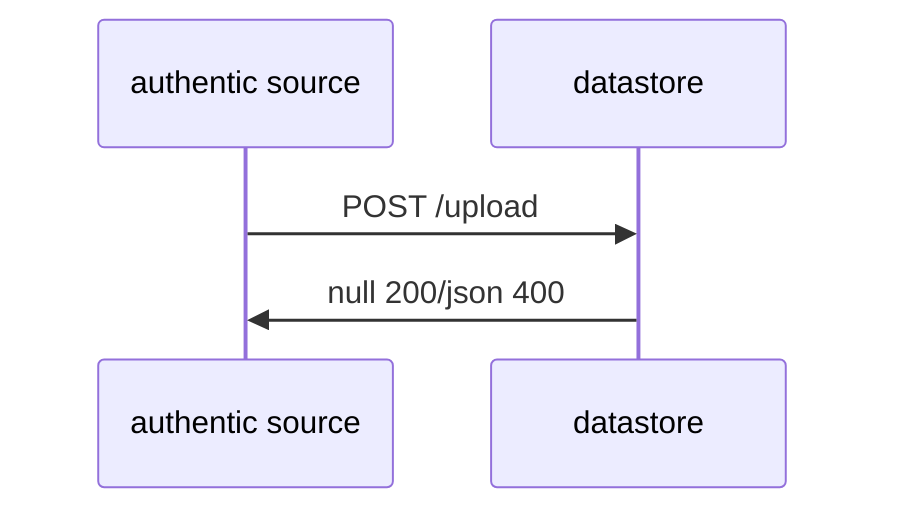

### Description

The Process starts with the authentic source which is uploading all relevant data to the `datastore`. All steps regarding the general application of an attestation are out of scope and reside to the internal processes of the authentic source.

The data upload consist of four objects used as input for the call. These are `meta`, `identity`, `attestation` and `document_data`.

First, the meta object consists of the `authentic_source_id`, document type and document ID. These act as the main identifier in the `datastore`. One document ID is valid and unique per document type and authentic source ID. Another required input is the institutional identifier of the person to ensure flexibility in identification and reduce susceptibility to errors. Again, this may also be valid and unique only in the domain of the authentic source. Therefore, in order to match an institutional person ID (authentic_source_person_id) a filter by authentic source ID needs to be applied before a selection operation is done. Finally, the meta object has defined revocation and collect ID as optional parameters. They may be set by the authentic source for special use cases and preferences. If not defined by the upload they shall be set equal to the document ID by the `datastore` System.

Second object is identity data which includes equal to the current definition of the PID, all possible parameters optional and required concerning the subject of the attestation to be uploaded. This is the first approach to handle the identity matching topic. An authentic Source shall upload all available information concerning the defined attributes. The more the better for later matching, against a PID from an EUDIW.

Third there is an attestation data object defined. This object contains attributes that shall be used for
display in a portal solution. Since there are many different credential types and relevant information
to display may differ, it was decided to define this as a generic object containing a short and long text
which can be filled by choice of the authentic source with relevant display information. In addition,
valid from and valid to information of the attestation, shall be provided by default.

Finally, the document data object needs to be submitted. We expect a JSON electronic document containing all business decision data matching to the document type and schema definitions.

### Attribute Table

#### Input / Request

| Type         | Attribute              | (r)eq. / (o)pt.      | Attribute Description      |
| ------------ | ---------------------- | -------------------- | -------------------------- |
| object | [meta {](#meta)                         | r | Instructions to build credentials|
| object | [revocation {}}](#revocation)            | o  ||
| array |  [identities []](#identity)               | o | Object containing all data for later identity mapping – optional as separate update and put endpoints are offered to add identity later; every document needs at least one identity object to be collectable |
| object|  [document_display {}](#document_display) | o | Generic Object which includes all information to display via portal API  |
| object | [document_data {}](#document_data)       | r |  JSON electronic document |
| string | document_data_version                    | r   | Version of the JSON document data object. MUST comply with <https://semver.org/> |

#### Output / Response

http OK 200, else http 400 and error object

#### Additional remarks on 'description_structured' object

As described, document_display should contain all information that is relevant for display in a user interface such as a portal. The object description structured contained therein remains undefined in terms of content and must therefore be coordinated between Authentic Source and a portal, for example. It may be sufficient to provide display texts in short and long form as well as the validity of the attestation in order to give the citizen a quick overview of the content of the attestation. The content of the object could therefore look like this:

| String     | description_short | o   | To display in the portal  |
| ---------- | ----------------- | --- | ------------------------- |
| string     | description_long  | o   | To display in the portal  |
| int64 | valid_from        | o   | Validity information of the business decision, which may differ from the validity of the credential. E.g. EHIC may be valid for 4 years (stated here) while the credential for technical reasons is only valid for two years. |
| int64 | valid_to          | o   | Validity information of the business decision, which may differ from the validity of the credential. E.g. EHIC may be valid for 4 years (stated here) while the credential for technical reasons is only valid for two years. |

## POST /notification

### Flowchart

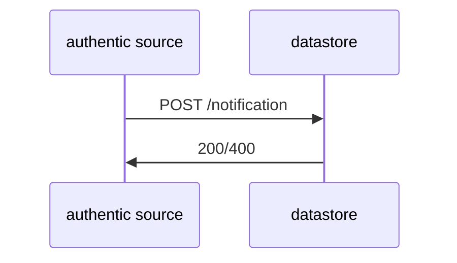

### Description

After the upload was successful the authentic source can call the get notification endpoint, to receive `base64_image` and `deep_link` to include them in existing notification means. This is split from the upload endpoint to allow fast mass uploads of documents and to allow openness for different system architectures as this information request may be done by a different authentic source component as the upload.

As explained before the three attributes used for unequivocal selection of an entry are required as input. These are `authentic_source_id`, `document_type` and `document_id`. A selection/ filter in the `datastore` must be executed in this order.

After identifying the respective entry in the `datastore` database, the `datastore` must generate a pickup link based on the `collect_id`. Note that this may be equal to the `document_id` if not further defined. The link should ultimately be formatted as a QR code, and both the link and QR code should be returned to the Authentic Source.

Link and QR code can be encoded according to the OID4VCI protocol with `collect_id` and `document_id` reference. However, as sharing of the PID by the EUDIW user is expected, it may be more practical to encode the link and QR code according to the OID4VP protocol and initiate it directly with the request for the credential. It is anticipated that both protocols may be utilized for functionality in presentation and subsequent issuance, and an efficient technical implementation for this purpose is yet to be devised. For the link to be created a specific endpoint needs to be known to the `datastore` which points to the Issuer System and can serve issuance requests by the EUDIW. It shall be possible to define this in a `datastore` config file/ properties.

After the QR code and link are received the authentic source may follow existing protocols and channels to notify the subject of the credential.

### Attribute Table

#### Input / Request

| Type | Attribute | (r)eq. / (o)pt. | Description |
| ------------------ | ---------------- | -------------------- | ----------------- |
| string             | authentic_source | r | globally unambiguous name of the issuing entity (agency or institution) |
| string             | document_type    | r | Type of Document, initially only “EHIC” or “PDA1” |
| string             | document_id      | r | uniq identifier within authentic_source and document_type namespace |

#### Output / Response

| Type | Attribute | (r)eq. / (o)pt. | Description |
| ------------------ | ---------------- | ----------- | ----------------- |
| object             | [qr](#qr)     | r | Link, formatted as QR-Code to initiate credential pickup with holder-wallet – Typestring which will be interpreted as image |

http OK 200, else 400 and error body

## PUT /document/identity

### Flowchart

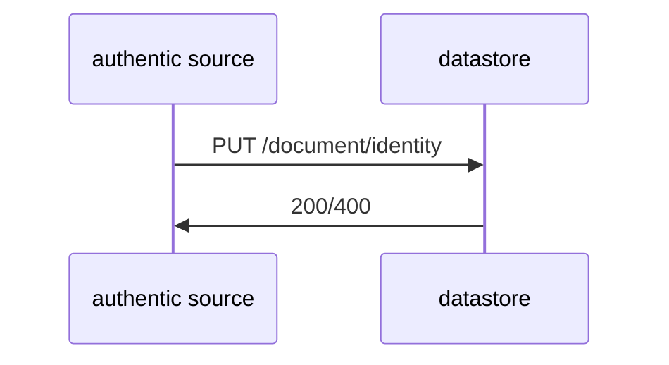

### Description

It is possible that more than one person is authorized to collect a credential. For example, if the Authentic Source has certain powers of representation. Information about the identity may also change or errors may occur during the upload. This endpoint should be used for each of these cases. It enables a new or updated/corrected identity to be attached to a specific document. It is identified by standard attributes `authentic_source`, `document_type` and `document_id` which are required. If an identity is to be updated or corrected, the obsolete identity must then be deleted with the following endpoint.

### Attribute Table

#### Input / Request

| Type       | Attribute        | (r)eq. / (o)pt. | Attribute Description|
| ---------- | ---------------- | -------------------- | ------------------ |
| string   | authentic_source         | r | globally unambiguous name of the issuing entity (agency or institution) |
| string   | document_type            | r | Type of Document, initially only “EHIC” or “PDA1” |
| string   | document_id              | r | uniq identifier within authentic_source and document_type namespace |
| array   | [identities []](#identity) | r | Object containing all data for later identity mapping – as defined in the upload endpoint |

### Output / Response

http OK 200, else 400 and error body

## DELETE /document/identity

### Flowchart

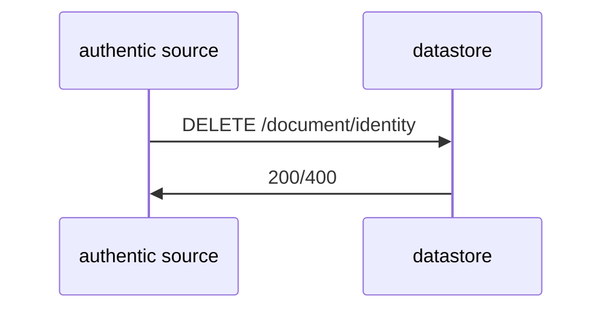

### Description

If an identity is no longer authorized to retrieve a credential or if it is an identity with incorrect/outdated attributes, it must be deleted using this endpoint. The document is identified again using the three main attributes. To subsequently select the identity object, the authentic_source_person_id must also be supplied.

### Attribute Table

#### Input / Request

| Type   | Attribute                  | (r)eq. / (o)pt. | Attibute Description |
| ------- | -------------------------- | -------------------- | ----------------------------------------------- |
| string | authentic_source           | r | globally unambiguous name of the issuing entity (agency or institution) |
| string | document_type              | r | Type of Document, initially only “EHIC” or “PDA1” |
| string | document_id                | r | uniq identifier within authentic_source and document_type namespace |
| string | authentic_source_person_id | r | unique identifier within authentic_source namespace AND globally unique within Authentic Source. |

### Output / Response

http OK 200, else 400 and error body

## DELETE /document

### Flowchart

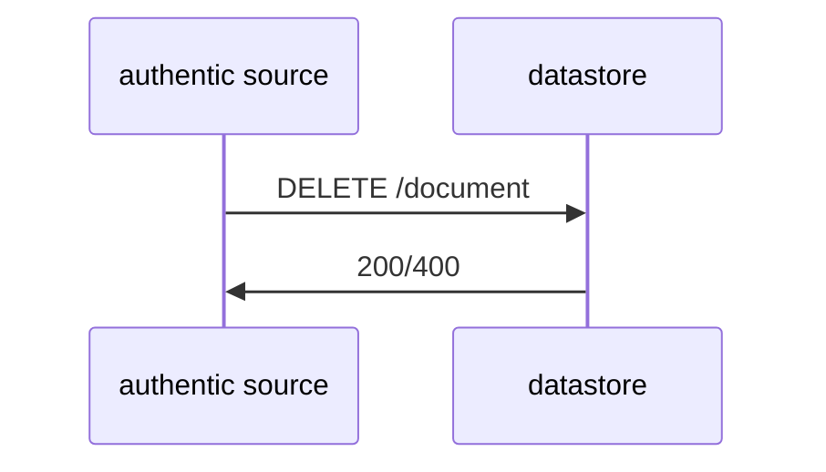

### Description

Another important endpoint for the upload API shall be used to delete uploaded data. Input are again the three parameters to select the unequivocal entry in the `datastore` database. The endpoint shall return a status code which shall be technical with error logs if occurring.

### Attribute Table

#### Input / Request

| Type | Attribute        | (r)eq. / (o)pt. | Attibute Description |
|-------|----------------|--------------------|--|
| string | authentic_source | r | globally unambiguous name of the issuing entity (agency or institution) |
| string | document_type    | r | Type of Document, initially only “EHIC” or “PDA1”                       |
| string | document_id      | r | unique identifier within authentic_source and document_type namespace   |

#### Output / Response

http OK 200, else 400 and error body

## POST /document/collect_id

### Flowchart

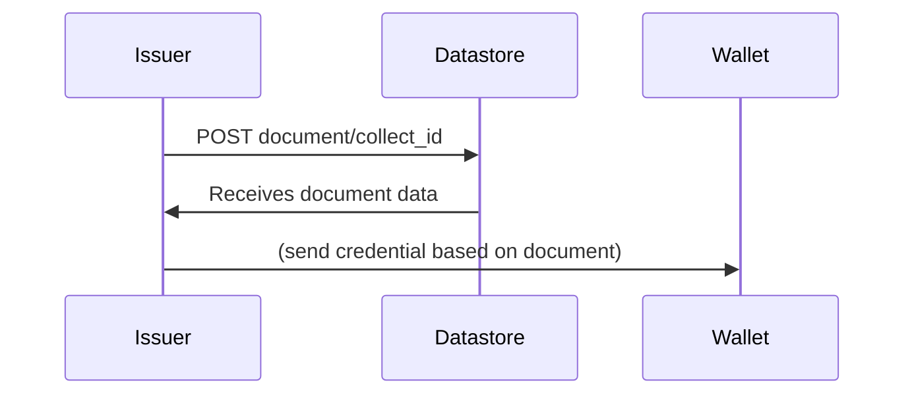

### Description

This endpoint is to be used by the Issuer System to retrieve specific document data from the `datastore` to be issued as credential. As mapping is done in the `datastore` the Call has to have identity information included. The inputs `authentic_source`, `document_type`, and `collect_id` are used to identify the correct attestation. After selection of the document, attribute based identity mapping is performed by the `datastore`. Only if this is successful, all credential relevant information gets returned to the Issuer System.

Note: Depending on the architecture, the issuer system will determine the endpoint to retrieve the document data based on the `authentic_source` input and the configuration of the Backend.

### Attribute Table

#### Input / Request

| Type                      | Attribute        | (r)eq. / (o)pt. | Attribute Description|
| ------------------------- | ---------------- | -------------------- | --------------------------------------------- |
| string | authentic_source          | r | globally unambiguous name of the issuing entity (agency or institution)                                                                                                    |
| string | document_type             | r | Type of Document, initially only “EHIC” or “PDA1”                                                                                                                          |
| string | collect_id                | r | Document reference ID for collection                                                                                                                                       |
| object | [identity {}](#identity)  | r | Object containing all data for later identity mapping, originating from a shared identity credential of the citizen wallet – attributes are defined in the upload endpoint |

#### Output / Response

| Type  | Attribute        | (r)eq. / (o)pt. | Attribute Description|
| ------ | ---------------- | -------------------- | ------------------------------ |
| object | [document_data {}](#document_data)   | r | JSON electronic document |
| object | [meta {}](#meta)                     | r | Technical metadata object, as defined in upload endpoint |

http OK 200, else 400 and error body

## POST /identity/mapping

### Flowchart

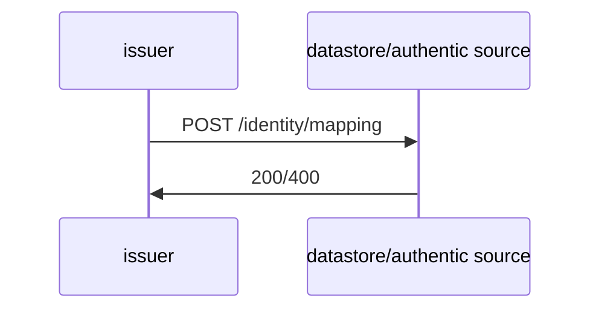

### Description

For testing and Scenarios 4 and 5 the identity mapping endpoint is envisioned. Input consists of `authentic_source` and the `identity` object with the information of the received PID. It shall return the institution specific `authentic_source_person_id` if an unequivocal match was found. If not, status information of the operation shall be returned.

Note: depending on the architecture, the issuer system will determine the endpoint to call based on the authentic_source input and the configuration of the Backend.

### Attribute Table

#### Input / Request

| Type | Attribute | (r)eq. / (o)pt. | Attibute Description  |
| ----- | --------- | -------------------- | ---------------- |
| string | authentic_source           | r | globally unambiguous name of the issuing entity (agency or institution) |
| object | [identity {](#identity)   | r | Object containing all data for later identity mapping – as defined in upload endpoint |
| string | authentic_source_person_id | o | unique identifier within authentic_source namespace AND globally unique within Authentic Source - optional, since this shall be the return value |
|  | }   | r |  |

#### Output / Response

| Type | Attribute | (r)eq. / (o)pt. | Attibute Description  |
| ----- | --------- | -------------------- | ---------------- |
| string | authentic_source_person_id | r | uniq identifier within authentic_source namespace AND globally uniq within Authentic Source. |

http OK 200, else 400 and error body

## POST /document/list

### Flowchart

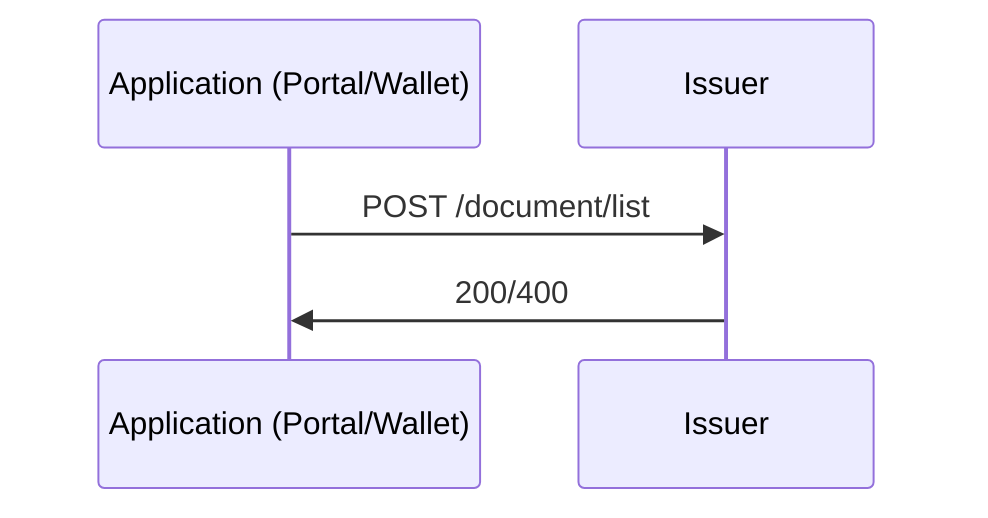

### Description

This endpoint shall be used to get all available attestations (-data) for  a specific person. The response data includes all document information relevant for display in the national portal (or on a wallet) including the `base64_image` and `deep_link`.

As there can be one `datastore` or one source database for each Authentic Source, the person is identified using the identity attributes from the citizen wallet provided in the process. If no further attributes are provided, the issuer system will make a call to each authentic source (or its `datastore`) set in the configuration. The Authentic Source is ultimately responsible for identity mapping and will return the relevant information from the available documents if successful. Finally, the issuer system will merge the results and respond to this call with a comprehensive list of results.

Optionally, attributes such as `authentic_source` or `document_type` can be supplied as input to reduce the call and the results to relevant information.

Also, `valid_to` and `valid_from` parameters are envisioned as additional input. It can be used by the portal request to limit the response of attestations to a specific time frame.

In the response are expected relevant `meta`-data per attestation such as `document_type` and `document_id` as well as the attestation_data, which is to be used for display information. Finally, QR-code and Deeplink are also included in the response per attestation for the citizen to initiate the pickup with his/her EUDIW.

### Attribute Table

#### Input / Request

| Type  | Attribute              | (r)eq. / (o)pt. | Attibute Description |
| ------ | -------------------------| -------------------- | ------------ |
| string | authentic_source         | o | globally unambiguous name of the issuing entity (agency or institution) |
| object | [identity {](#identity) | r | as defined in upload |
| string | authentic_source_person_id | o | unique identifier within authentic_source namespace AND globally unique within Authentic Source - optional to enable a request independent of authentic source |
|  | }   | r |  |
| string | document_type            | o | Type of Document, initially only “EHIC” or “PDA1” for filter; if empty, all types |
| int64  | valid_from               | o | credentials valid from or specific date; if empty current date |
| int64  | valid_to                 | o | credentials valid after specific date; if empty max date |

#### Output / Response

| Type  | Attribute | (r)eq. / (o)pt. | Attibute Description |
| ------| ---------------------- | -------------------- | --- |
| array | [documentlist](#document_list) | | |

http OK 200, else 400 and error body

## POST /document

### Flowchart

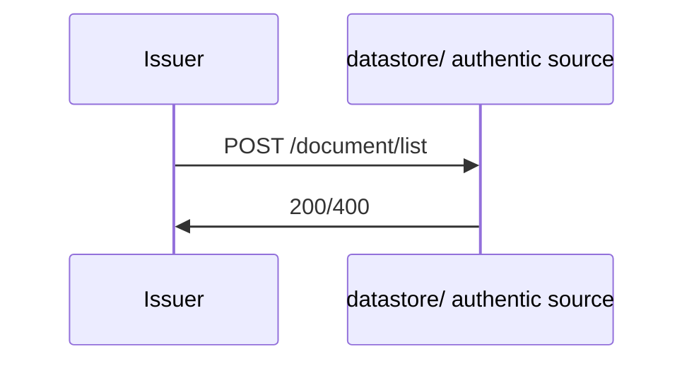

### Description

The /document endpoint is currently specifically designed for scenario 5. It allows an issuer system to retrieve a document or all credential-relevant information from the `datastore`. A special feature here is that identification is not via the `collect_id` but the `document_id` and no identity is required as input. This is made possible by the specific sequence of the scenario. In addition, the endpoint can be used for test purposes or setups with outsourced identity mapping, for example.

Note: depending on the architecture, the issuer system will determine the endpoint to call based on the `authentic_source` input and the configuration of the backend.

### Attribute Table

#### Input / Request

| Type    | Attribute        | (r)eq. / (o)pt. | Attibute Description |
| ------- | ---------------- | -------------------- | ---------------- |
| string | authentic_source | r | globally unambiguous name of the issuing entity (agency or institution) |
| string | document_type    | r | Type of Document, initially only “EHIC” or “PDA1”                       |
| string | document_id      | r | uniq identifier within authentic_source and document_type namespace     |

#### Output / Response

| Type   | Attribute        | (r)eq. / (o)pt. | Attibute Description |
| ------- | ---------------- | -------------------- | ---------------- |
| object | document_data    | r | JSON electronic document |
| object | [meta {}](#meta) | r | Technical metadata object as defined in upload endpoint |

http OK 200, else 400 and error body

## POST /consent

### Flowchart

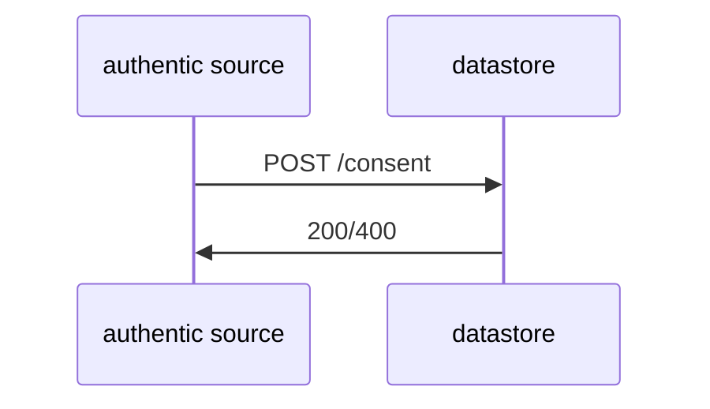

### Description

Since the approach of some participants is to carry out the pilot and test with real data and citizens, the prerequisite is to obtain and store the consent of the citizens for participation in the procedure. In order to ensure a fast and standardized procedure, the following method offers a possibility to store such information in the `datastore`. Whether the use of the endpoint is necessary must be decided individually by the participants.

The endpoint can also be used if an agreement has been revised. Calling the endpoint will switch the internal status boolean.

### Attribute Table

#### Input / Request

| Type          | Attribute                  | (r)eq. / (o)pt. | Attribute Description |
| -------- | -------------------------- | -------------------- | ---------------------- |
| string  | authentic_source           | r | globally unambiguous name of the issuing entity (agency or institution) |
| string  | authentic_source_person_id | r | uniq identifier within authentic_source namespace AND globally uniq within Authentic Source |
| string  | consent_to                 | o | String representing the specific consent. |
| string  | session_id                 | o | Session identifying information for further reference and allocability |

#### Output / Response

http OK 200, else 400 and error body

## POST /consent/get

### Flowchart

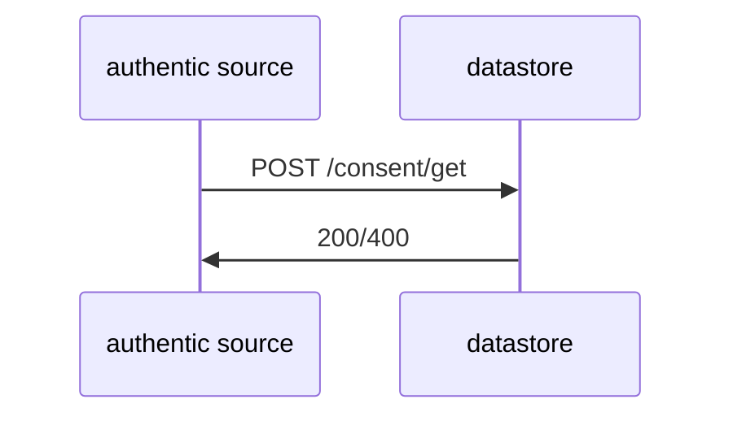

### Description

If the POST /consent defined above is used, the following endpoint can be used to query the status of a citizen's consent. Depending on the participants, this method can be used as additional security before issuing a credential.

### Attribute Table

#### Input / Request

| Type   | Attribute                  | (r)eq. / (o)pt. | Attibute Description |
| ------ | -------------------------- | -------------------- | --- |
| string | authentic_source           | r | globally unambiguous name of the issuing entity (agency or institution) |
| string | authentic_source_person_id | r | uniq identifier within authentic_source namespace AND globally uniq within Authentic Source |

#### Output / Response

| Type     | Attribute   | (r)eq. / (o)pt. | Attibute Description|
| ---------| ----------- | -------------------- | --------------- |
| string   | consent_to  | r | String representing the specific consent.|
| string   | session_id  | r | Session identifying information for further reference and allocability|
| int64    | created_at  | r | Technical timestamp on when the entry was uploaded to the `datastore`|

http OK 200, else 400 and error body

## POST /document/revoke

### Flowchart

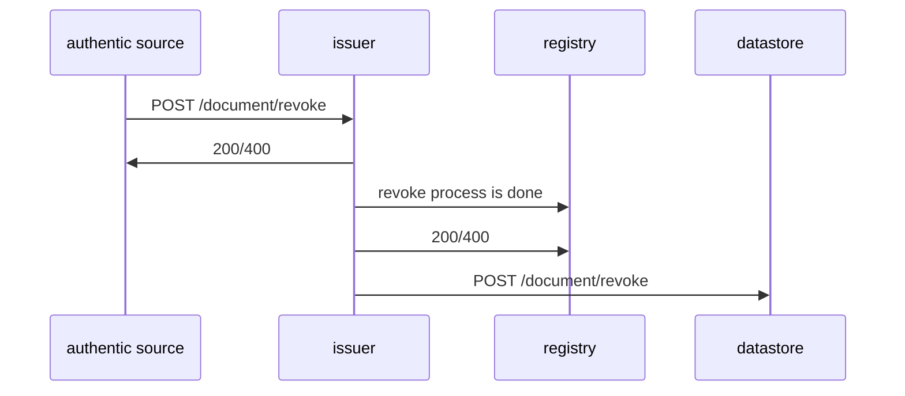

### Description

To clarify the revocation system, it should be known that the `revocation_id` is set by the Authentic Source. Usually this will be the same as the `document_id`, but depending on the use case and the intention of the Authentic Source it is possible that two credentials point to the same `revocation_id`.

In order for the Issuer System to select the correct revocation entry in the registry, `authentic_source`, `document_type` and `revocation`-object must be submitted as input from the Authentic Source. The Issuer system has internally set the endpoint for the revocation registry.

The `reference`-object allows flexibility for future decisions and flows. `document_id` in this case will indecate the follow up credential, which may be interpreted by the EUDIW to automatically establish a new pick-up flow to get the new credential version. This is to be further decided. `Revoke_at` defines a specific date and time in the future to which the credential shall be defined as revoked.

This endpoint shall only revoke the credential in the registry and don’t delete the attestation data in the `datastore`. The `DELETE /document` endpoint can be used afterwards if the deletion is intended. Nonetheless there could be a pick-up request for an already revoked credential. In order for the Issuer System to respond properly, the information should still exist and be flagged as revoked. This can the Issuer calling the same endpoint towards the `datastore` of the respective authentic source. It shall be called by the issuer system after this endpoint /revoke is called and the revocation is done.
The endpoint responds with a simple status code with information about the operation status and error log if occurring.

### Attribute Table

#### Input / Request

| Type    | Attribute        | (r)eq. / (o)pt. | Attibute Description |
| ------- | ---------------- | -------------------- | --------------- |
| string  | authentic_source             | r | globally unambiguous name of the issuing entity (agency or institution) |
| string  | document_type                | r | Type of Document, initially only “EHIC” or “PDA1” |
| object  | [revocation {}](#revocation) | r | Containing relevant revocation information as defined in the upload endpoint |

#### Output / Response

http 200 or http 400 and error body

## Types

### meta{}

|type| Attribute | required | description |
| ----------------- | --------------------- | --- | ---------------------------------------------------------- |
| string            | authentic_source              | r   | globally unambiguous name of the issuing entity (agency or institution) |
| string            | document_type                 | r   | Type of Document, initially only “EHIC” or “PDA1” |
| string            | document_id                   | r   | Primary key of the business decision - unique identifier within authentic_source and document_type namespace[[MF1]](#_msocom_1) |
| boolean           | real_data                     | r   | “true” or “false” – For Pilot, indicating the use of real or test data |
| object            | [collect{}](#collect)         | o   | This is defining information for general pick-up by QR-Code/link.   |
| int64             | credential_valid_from         | o   | Validity information of the future credential; If empty validity is default equal to attestation validity |
| int64             | credential_valid_to           | o   | Validity information of the future credential; If empty validity is default equal to attestation validity |
| object            | [revocation{}](#revocation)   | o   |      |

### collect{}

|type| Attribute | required | description |
| ----------------- | --------------------- | --- | ---------------------------------------------------------- |
| string            | id                    | r   | If not defined by institution it should be set to document_id value after upload. Used to not expose the real document id, thus limiting fraud. |
| int64             | valid_until         | r   | If not defined the collect id can be used indefinitely, otherwise issuer should reject request after this date. |

### revocation{}

|type| Attribute | required | description       |
| ---------- | ---------------- | --- | ------- |
| string     | id            | r | ID for credential revocation; If not defined by institution it should be set to document_id value after upload. Different value may be used to allow credential coupling – having one revocation status for multiple credentials |
| object     | [reference](#reference)  | o | Optional reference to follow-up credential|
| int64      | revoke_at                | o | Value to define a specific time on when the revocation shall be effective; if empty, revoke system date, else on specified datetime - retroactive revocation must not be allowed|
| string     | reason                   | o | Could include a display text for the Issuer System, wont be included in revocation registry|
| boolean    | revoked                  | o | Information on whether the respective credential is revoked; Allows to upload attestation information of credentials that are already revoked – if not specified this is set to false by default|

### reference{}

|type| Attribute | required | description |
| ---------- | ---------------- | --- | --- |
| string     | authentic_source | o   | globally unambiguous name of the issuing entity (agency or institution)|
| string     | document_type    | o   | Type of Document, initially only “EHIC” or “PDA1”|
| string     | document_id      | o   | Primary key of the business decision - unique identifier within authentic_source and document_type namespace[[MF1]](#_msocom_1)|

### identity{}

|type| Attribute | required | description |
| ------ | -------------------------- | --- | ----------------------------------------------------------------------------------------------------- |
| string | authentic_source_person_id | r   | unique identifier within authentic_source namespace AND globally unique within Authentic Source.      |
| object | [schema{}](#schema)        | r   | Information about the provided attributes for the Authentic Source Person information                 |
| string | family_name                | r   | As in current PID namespace                                                                           |
| string | given_name                 | r   | As in current PID namespace                                                                           |
| string | birth_date                 | r   | As in current PID namespace                                                                           |
| string | family_name_birth          | o   | As in current PID namespace                                                                           |
| string | given_name_birth           | o   | As in current PID namespace                                                                           |
| string | birth_place                | o   | As in current PID namespace                                                                           |
| string | gender                     | o   | As in current PID namespace                                                                           |
| string | birth_country              | o   | As in current PID namespace                                                                           |
| string | birth_state                | o   | As in current PID namespace                                                                           |
| string | birth_city                 | o   | As in current PID namespace                                                                           |
| string | resident_address           | o   | As in current PID namespace                                                                           |
| string | resident_country           | o   | As in current PID namespace                                                                           |
| string | resident_state             | o   | As in current PID namespace                                                                           |
| string | resident_city              | o   | As in current PID namespace                                                                           |
| string | resident_postal_code       | o   | As in current PID namespace                                                                           |
| string | resident_street            | o   | As in current PID namespace                                                                           |
| string | resident_house_number      | o   | As in current PID namespace                                                                           |
| string | nationality                | o   | As in current PID namespace                                                                           |

### schema{}

|type| Attribute | required | description |
| ------ | ---------------------- | --- | ---------------- |
| string | name     | r | For the pilot we expect simple strings i.e. DK, AT, DE, but could be more varied if complexity arise. |
| string | version  | o | Identity data schema version. MUST comply with <https://semver.org/>|

### document_data{}

There is currently no verification of the contents of this object. In the future the system will check the structure and attributes of this object based on `document_type` and `document_data_version`. There will be specific schemas defined based on the type of the document. 
The currents schema definitions are defined =here= and can be used for testing. They may be subject to change.

### document_display{}

|type| Attribute | required | description |
| ------ | ---------------------- | --- | ---------------- |
| string | version                | o   | Version of the attestation data object – to be defined by the Authentic Source. MUST comply with <https://semver.org/> |
| string | type                   | o   | For internal display interpretation/differentiation                                                                        |
| object | description_structured | o   | JSON Object with key-value-pairs for building display data[[MF1]](#_msocom_1)                                              |

### document_list{}

this is just a type to make presentation easier, it will not affect anything in the client API.

| Type  | Attribute              | (r)eq. / (o)pt. | Attibute Description |
| ------| ---------------------- | -------------------- | ------------------------- |
| object | [meta {}](#meta)                         | r | Technical metadata object - content as defined in the upload|
| object | [document_display {}](#document_display) | o | Generic Object which includes all information to display via portal API|
| object | [qr {}](#qr)                             | r | QR-Code/Link Object, defined in notification endpoint|

### qr{}

| Type  | Attribute              | (r)eq. / (o)pt. | Attibute Description |
| ------| ---------------------- | -------------------- | ------------------------- |
| string | base64_image | r | |
| string | deep_link | r | |

## Document data schemas

### PDA1
```json
{
    "$schema": "https://json-schema.org/draft/2020-12/schema",
    "type": "object",
    "properties": {
        "person": {
            "type": "object",
            "properties": {
                "forename": {
                    "type": "string"
                },
                "family_name": {
                    "type": "string"
                },
                "date_of_birth": {
                    "type": "string",
                    "format": "date"
                },
                "other_elements": {
                    "type": "object",
                    "properties": {
                        "sex": {
                            "$ref": "#/$defs/sex_type"
                        },
                        "forename_at_birth": {
                            "type": "string"
                        },
                        "family_name_at_birth": {
                            "type": "string"
                        }
                    }
                }
            },
            "required": [
                "forename",
                "family_name",
                "date_of_birth"
            ]
        },
        "social_security_pin": {
            "type": "string",
            "description": "Personal Identification Number as defined in the issuing institution"
        },
        "nationality": {
            "type": "array",
            "items": {
                "$ref": "#/$defs/iso3166_1_3_world_country_code"
            },
            "minItems": 1,
            "uniqueItems": true
        },
        "details_of_employment": {
            "type": "array",
            "items": {
                "type": "object",
                "properties": {
                    "type_of_employment": {
                        "$ref": "#/$defs/employment_type"
                    },
                    "name": {
                        "type": "string"
                    },
                    "ids_of_employer": {
                        "type": "array",
                        "items": {
                            "type": "object",
                            "properties": {
                                "employer_id": {
                                    "type": "string"
                                },
                                "type_of_id": {
                                    "$ref": "#/$defs/company_id_type"
                                }
                            }
                        },
                        "uniqueItems": true
                    },
                    "address": {
                        "$ref": "#/$defs/address"
                    }
                },
                "required": [
                    "type_of_employment",
                    "name",
                    "address"
                ]
            },
            "minItems": 1,
            "uniqueItems": true
        },
        "places_of_work": {
            "type": "array",
            "items": {
                "type": "object",
                "properties": {
                    "no_fixed_place_of_work_exist": {
                        "type": "boolean",
                        "description": "Multiplied from the EESSI model to be mapped on to each country"
                    },
                    "country_work": {
                        "$ref": "#/$defs/iso3166_1_eu_efta_country_code"
                    },
                    "place_of_work": {
                        "type": "array",
                        "items": {
                            "type": "object",
                            "properties": {
                                "company_vessel_name": {
                                    "type": "string"
                                },
                                "flag_state_home_base": {
                                    "type": "string"
                                },
                                "ids_of_company": {
                                    "type": "array",
                                    "items": {
                                        "type": "object",
                                        "properties": {
                                            "company_id": {
                                                "type": "string"
                                            },
                                            "type_of_id": {
                                                "$ref": "#/$defs/company_id_type"
                                            }
                                        }
                                    },
                                    "uniqueItems": true
                                },
                                "address": {
                                    "$ref": "#/$defs/address_no_country"
                                }
                            }
                        },
                        "uniqueItems": true
                    }
                },
                "required": [
                    "no_fixed_place_of_work_exist",
                    "country_work"
                ]
            },
            "minItems": 1,
            "uniqueItems": true
        },
        "decision_legislation_applicable": {
            "type": "object",
            "properties": {
                "member_state_which_legislation_applies": {
                    "$ref": "#/$defs/iso3166_1_eu_efta_country_code"
                },
                "transitional_rules_apply": {
                    "type": "boolean",
                    "description": "Not mapped from the EESSI model, but added to the payload schema to be able to map the transitional rules"
                },
                "starting_date": {
                    "type": "string",
                    "format": "date"
                },
                "ending_date": {
                    "type": "string",
                    "format": "date",
                    "default": "2499-01-01",
                    "description": "If the document has no end date(open ended period), the value '2499-01-01' will be used."
                }
            },
            "required": [
                "member_state_which_legislation_applies",
                "starting_date"
            ]
        },
        "status_confirmation": {
            "$ref": "#/$defs/status_confirmation_code"
        },
        "unique_number_of_issued_document": {
            "$ref": "#/$defs/document_identifier"
        },
        "competent_institution": {
            "type": "object",
            "properties": {
                "institution_id": {
                    "$ref": "#/$defs/eessi_institution_id"
                },
                "institution_name": {
                    "type": "string"
                },
                "country_code": {
                    "$ref": "#/$defs/iso3166_1_eu_efta_country_code"
                }
            },
            "required": [
                "institution_id",
                "country_code"
            ]
        }
    },
    "required": [
        "social_security_pin",
        "nationality",
        "details_of_employment",
        "places_of_work",
        "decision_legislation_applicable",
        "status_confirmation",
        "unique_number_of_issued_document",
        "competent_institution"
    ],
    "$defs": {
        "iso3166_1_eu_efta_country_code": {
            "type": "string",
            "pattern": "^(AT|BE|BG|HR|CY|CZ|DK|EE|FI|FR|DE|EL|HU|IS|IE|IT|LV|LI|LT|LU|MT|NL|NO|PL|PT|RO|SK|SI|ES|SE|CH|UK|EU){1}$",
            "description": "Country code according to EU/EFTA-Countries according to ISO-3166-1 + UK"
        },
        "iso3166_1_world_country_code": {
            "type": "string",
            "pattern": "^(AT|BE|BG|HR|CY|CZ|DK|EE|FI|FR|DE|EL|HU|IS|IE|IT|LV|LI|LT|LU|MT|NL|NO|PL|PT|RO|SK|SI|ES|SE|CH|UK|AF|AX|AL|DZ|AS|AD|AO|AI|AQ|AG|AR|AM|AW|AU|AZ|BS|BH|BD|BB|BY|BZ|BJ|BM|BT|BO|BQ|BA|BW|BV|BR|IO|BN|BF|BI|CV|KH|CM|CA|KY|CF|TD|CL|CN|CX|CC|CO|KM|CG|CD|CK|CR|CI|CU|CW|DJ|DM|DO|EC|EG|SV|GQ|ER|ET|FK|FO|FJ|GF|PF|TF|GA|GM|GE|GH|GI|GL|GD|GP|GU|GT|GG|GN|GW|GY|HT|HM|VA|HN|HK|IN|ID|IR|IQ|IM|IL|JM|JP|JE|JO|KZ|KE|KI|KP|KR|XK|KW|KG|LA|LB|LS|LR|LY|MO|MK|MG|MW|MY|MV|ML|MH|MQ|MR|MU|YT|MX|FM|MD|MC|MN|ME|MS|MA|MZ|MM|NA|NR|NP|NC|NZ|NI|NE|NG|NU|NF|MP|OM|PK|PW|PS|PA|PG|PY|PE|PH|PN|PR|QA|RE|RU|RW|BL|SH|KN|LC|MF|PM|VC|WS|SM|ST|SA|SN|RS|SC|SL|SG|SX|SB|SO|ZA|GS|SS|LK|SD|SR|SJ|SZ|SY|TW|TJ|TZ|TH|TL|TG|TK|TO|TT|TN|TR|TM|TC|TV|UG|UA|AE|UM|US|UY|UZ|VU|VE|VN|VG|VI|WF|EH|YE|ZM|ZW){1}$",
            "description": "ISO-3166-1 Country-Codes for all Countries"
        },
        "iso3166_1_3_world_country_code": {
            "type": "string",
            "pattern": "^(AT|BE|BG|HR|CY|CZ|DK|EE|FI|FR|DE|EL|HU|IS|IE|IT|LV|LI|LT|LU|MT|NL|NO|PL|PT|RO|SK|SI|ES|SE|CH|UK|XR|XS|XU|AF|AL|DZ|AD|AO|AG|AR|AM|AU|AZ|BS|BH|BD|BB|BY|BZ|BJ|BT|BO|BA|BW|BR|BN|BF|BI|KH|CM|CA|CV|CF|TD|CL|CN|CO|KM|CG|CD|CR|CI|CU|DJ|DM|DO|EC|EG|SV|GQ|ER|ET|FJ|GA|GM|GE|GH|GD|GT|GN|GW|GY|HT|VA|HN|IN|ID|IR|IQ|IL|JM|JP|JO|KZ|KE|KI|KP|KR|KW|KG|LA|LB|LS|LR|LY|MK|MG|MW|MY|MV|ML|MH|MR|MU|MX|FM|MD|MC|MN|ME|MA|MZ|MM|NA|NR|NP|NZ|NI|NE|NG|OM|PK|PW|PS|PA|PG|PY|PE|PH|QA|RU|RW|KN|LC|VC|WS|SM|ST|SA|SN|RS|SC|SL|SG|SB|SO|ZA|SS|LK|SD|SR|SZ|SY|TJ|TZ|TH|TL|TG|TO|TT|TN|TR|TM|TV|UG|UA|AE|US|UY|UZ|VU|VE|VN|YE|ZM|ZW|BQAQ|BUMM|BYAA|CTKI|CSHH|DYBJ|NQAQ|TPTL|FXFR|AIDJ|FQHH|DDDE|GEHH|JTUM|MIUM|ANHH|NTHH|NHVU|PCHH|PZPA|CSXX|SKIN|RHZW|HVBF|PUUM|SUHH|VDVN|WKUM|YDYE|YUCS|ZRCD){1}$",
            "description": "ISO-3166-1 Country-Codes for all Countries plus 4-Digit Country-Codes for historic countries according to ISO-3166_3"
        },
        "sex_type": {
            "type": "string",
            "pattern": "^(01|02|98){1}$",
            "description": "01 - Male, 02 - Female, 98 - Unknown"
        },
        "company_id_type": {
            "type": "string",
            "pattern": "^(01|02|03|98){1}$",
            "description": "01 - Identication registration, 02 - Social Security, 03 - Fiscal, 98 - Unknown"
        },
        "employment_type": {
            "type": "string",
            "pattern": "^(01|02){1}$",
            "description": "01 - Employment, 02 - SelfEmployment"
        },
        "eessi_institution_id": {
            "type": "string",
            "pattern": "^(AT|BE|BG|HR|CY|CZ|DK|EE|FI|FR|DE|EL|HU|IS|IE|IT|LV|LI|LT|LU|MT|NL|NO|PL|PT|RO|SK|SI|ES|SE|CH|UK|EU):[a-zA-Z0-9]{4,10}$",
            "description": "Institution ID in the format 'AT:19789'"
        },
        "status_confirmation_code": {
            "type": "string",
            "pattern": "^(01|02|03|04|05|06|07|08|09|10|11|12){1}$",
            "description": "Mapped from EESSI articleRegulationECNo8832004 A009 01->01, 02->03; 01 - Posted employed person, 02 - Employed working in 2 or more states, 03 - Posted self employed person, 04 - Selfemployed working in 2 or more states, 05 - Civil Servant, 06 - Contract staff, 07 - Mariner, 08 - Working as a employed person and as a selfemployed person in different states, 09 - Working as a civil servant in one State and as an employed / self-employed person in one or more other States, 10 - Flight or cabin crew member, 11 - Exception, 12 - Working as an employed / self-employed person in the State inwhich the legeslation applies"
        },
        "document_identifier": {
            "type": "string",
            "pattern": "^[-a-zA-Z0-9]{1,65}$"
        },
        "address": {
            "type": "object",
            "properties": {
                "street": {
                    "type": "string"
                },
                "town": {
                    "type": "string"
                },
                "postal_code": {
                    "type": "string"
                },
                "country": {
                    "$ref": "#/$defs/iso3166_1_world_country_code"
                }
            },
            "required": [
                "town",
                "country"
            ]
        },
        "address_no_country": {
            "type": "object",
            "properties": {
                "street": {
                    "type": "string"
                },
                "town": {
                    "type": "string"
                },
                "postal_code": {
                    "type": "string"
                }
            },
            "required": [
                "town"
            ]
        }
    }
}
```

### PDA1 Example


### EHIC

```json
{
    "$schema": "https://json-schema.org/draft/2020-12/schema",
    "type": "object",
    "properties": {
        "subject": {
            "type": "object",
            "properties": {
                "forename": {
                    "type": "string"
                },
                "family_name": {
                    "type": "string"
                },
                "date_of_birth": {
                    "type": "string",
                    "format": "date"
                },
                "other_elements": {
                    "type": "object",
                    "properties": {
                        "sex": {
                            "$ref": "#/$defs/sex_type"
                        },
                        "forename_at_birth": {
                            "type": "string"
                        },
                        "family_name_at_birth": {
                            "type": "string"
                        }
                    }
                }
            },
            "required": [
                "forename",
                "family_name",
                "date_of_birth"
            ]
        },
        "social_security_pin": {
            "type": "string",
            "description": "Personal Identification Number as defined in the issuing institution"
        },
        "period_entitlement": {
            "type": "object",
            "properties": {
                "starting_date": {
                    "type": "string",
                    "format": "date"
                },
                "ending_date": {
                    "type": "string",
                    "format": "date"
                }
            },
            "required": [
                "starting_date",
                "ending_date"
            ]
        },
        "document_id": {
            "type": "string",
            "pattern": "^[-a-zA-Z0-9]{1,65}$"
        },
        "competent_institution": {
            "type": "object",
            "properties": {
                "institution_id": {
                    "$ref": "#/$defs/eessi_institution_id"
                },
                "institution_name": {
                    "type": "string"
                },
                "institution_country": {
                    "$ref": "#/$defs/iso3166_1_eu_efta_country_code"
                }
            },
            "required": [
                "institution_id",
                "institution_country"
            ]
        }
    },
    "required": [
        "social_security_pin",
        "period_entitlement",
        "document_id",
        "competent_institution"
    ],
    "$defs": {
        "iso3166_1_eu_efta_country_code": {
            "type": "string",
            "pattern": "^(AT|BE|BG|HR|CY|CZ|DK|EE|FI|FR|DE|EL|HU|IS|IE|IT|LV|LI|LT|LU|MT|NL|NO|PL|PT|RO|SK|SI|ES|SE|CH|UK|EU){1}$",
            "description": "Country code according to EU/EFTA-Countries according to ISO-3166-1 + UK"
        },
        "sex_type": {
            "type": "string",
            "pattern": "^(01|02|98){1}$",
            "description": "01 - Male, 02 - Female, 98 - Unknown"
        },
        "eessi_institution_id": {
            "type": "string",
            "pattern": "^(AT|BE|BG|HR|CY|CZ|DK|EE|FI|FR|DE|EL|HU|IS|IE|IT|LV|LI|LT|LU|MT|NL|NO|PL|PT|RO|SK|SI|ES|SE|CH|UK|EU):[a-zA-Z0-9]{4,10}$",
            "description": "Institution ID in the format 'AT:19789'"
        }
    }
}
```

### EHIC Example

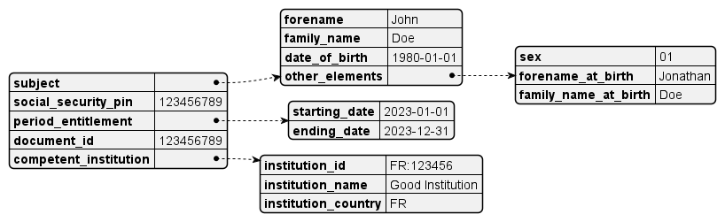

## Error response

```json
    {
        "error": {
            "title":"",
            "details": {}
        }
    }
```

## Normal repsonse JSON

```json
    {
        "data": {...}
    }
```

### Known error titles

|error title | description |
|--|--|
| validation_error      | one or more attribute is missing or wrong |
| internal_server_error | general error |
