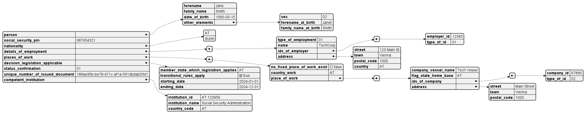

# PDA1

```json
{
    "$schema": "https://json-schema.org/draft/2020-12/schema",
    "type": "object",
    "properties": {
        "social_security_pin": {
            "type": "string",
            "description": "Personal Identification Number as defined in the issuing institution"
        },
        "nationality": {
            "type": "array",
            "items": {
                "$ref": "#/$defs/iso3166_1_3_world_country_code"
            },
            "minItems": 1,
            "uniqueItems": true
        },
        "details_of_employment": {
            "type": "array",
            "items": {
                "type": "object",
                "properties": {
                    "type_of_employment": {
                        "$ref": "#/$defs/employment_type"
                    },
                    "name": {
                        "type": "string"
                    },
                    "ids_of_employer": {
                        "type": "array",
                        "items": {
                            "type": "object",
                            "properties": {
                                "employer_id": {
                                    "type": "string"
                                },
                                "type_of_id": {
                                    "$ref": "#/$defs/company_id_type"
                                }
                            }
                        },
                        "uniqueItems": true
                    },
                    "address": {
                        "$ref": "#/$defs/address"
                    }
                },
                "required": [
                    "type_of_employment",
                    "name",
                    "address"
                ]
            },
            "minItems": 1,
            "uniqueItems": true
        },
        "places_of_work": {
            "type": "array",
            "items": {
                "type": "object",
                "properties": {
                    "a_fixed_place_of_work_exists": {
                        "type": "boolean",
                        "description": "Multiplied from the EESSI model to be mapped on to each country"
                    },
                    "country_work": {
                        "$ref": "#/$defs/iso3166_1_eu_efta_country_code"
                    },
                    "place_of_work": {
                        "type": "array",
                        "items": {
                            "type": "object",
                            "properties": {
                                "company_vessel_name": {
                                    "type": "string"
                                },
                                "flag_state_home_base": {
                                    "type": "string"
                                },
                                "ids_of_company": {
                                    "type": "array",
                                    "items": {
                                        "type": "object",
                                        "properties": {
                                            "company_id": {
                                                "type": "string"
                                            },
                                            "type_of_id": {
                                                "$ref": "#/$defs/company_id_type"
                                            }
                                        }
                                    },
                                    "uniqueItems": true
                                },
                                "address": {
                                    "$ref": "#/$defs/address_no_country"
                                }
                            }
                        },
                        "uniqueItems": true
                    }
                },
                "required": [
                    "a_fixed_place_of_work_exists",
                    "country_work"
                ]
            },
            "minItems": 1,
            "uniqueItems": true
        },
        "decision_legislation_applicable": {
            "type": "object",
            "properties": {
                "member_state_which_legislation_applies": {
                    "$ref": "#/$defs/iso3166_1_eu_efta_country_code"
                },
                "transitional_rules_apply": {
                    "type": "boolean",
                    "description": "Not mapped from the EESSI model, but added to the payload schema to be able to map the transitional rules"
                },
                "starting_date": {
                    "type": "string",
                    "format": "date"
                },
                "ending_date": {
                    "type": "string",
                    "format": "date",
                    "default": "2499-01-01",
                    "description": "If the document has no end date(open ended period), the value '2499-01-01' will be used."
                }
            },
            "required": [
                "member_state_which_legislation_applies",
                "starting_date"
            ]
        },
        "status_confirmation": {
            "$ref": "#/$defs/status_confirmation_code"
        },
        "unique_number_of_issued_document": {
            "$ref": "#/$defs/document_identifier"
        },
        "competent_institution": {
            "type": "object",
            "properties": {
                "institution_id": {
                    "$ref": "#/$defs/eessi_institution_id"
                },
                "institution_name": {
                    "type": "string"
                },
                "country_code": {
                    "$ref": "#/$defs/iso3166_1_eu_efta_country_code"
                }
            },
            "required": [
                "institution_id",
                "country_code"
            ]
        }
    },
    "required": [
        "social_security_pin",
        "nationality",
        "details_of_employment",
        "places_of_work",
        "decision_legislation_applicable",
        "status_confirmation",
        "unique_number_of_issued_document",
        "competent_institution"
    ],
    "$defs": {
        "iso3166_1_eu_efta_country_code": {
            "type": "string",
            "pattern": "^(AT|BE|BG|HR|CY|CZ|DK|EE|FI|FR|DE|EL|HU|IS|IE|IT|LV|LI|LT|LU|MT|NL|NO|PL|PT|RO|SK|SI|ES|SE|CH|UK|EU){1}$",
            "description": "Country code according to EU/EFTA-Countries according to ISO-3166-1 + UK"
        },
        "iso3166_1_world_country_code": {
            "type": "string",
            "pattern": "^(AT|BE|BG|HR|CY|CZ|DK|EE|FI|FR|DE|EL|HU|IS|IE|IT|LV|LI|LT|LU|MT|NL|NO|PL|PT|RO|SK|SI|ES|SE|CH|UK|AF|AX|AL|DZ|AS|AD|AO|AI|AQ|AG|AR|AM|AW|AU|AZ|BS|BH|BD|BB|BY|BZ|BJ|BM|BT|BO|BQ|BA|BW|BV|BR|IO|BN|BF|BI|CV|KH|CM|CA|KY|CF|TD|CL|CN|CX|CC|CO|KM|CG|CD|CK|CR|CI|CU|CW|DJ|DM|DO|EC|EG|SV|GQ|ER|ET|FK|FO|FJ|GF|PF|TF|GA|GM|GE|GH|GI|GL|GD|GP|GU|GT|GG|GN|GW|GY|HT|HM|VA|HN|HK|IN|ID|IR|IQ|IM|IL|JM|JP|JE|JO|KZ|KE|KI|KP|KR|XK|KW|KG|LA|LB|LS|LR|LY|MO|MK|MG|MW|MY|MV|ML|MH|MQ|MR|MU|YT|MX|FM|MD|MC|MN|ME|MS|MA|MZ|MM|NA|NR|NP|NC|NZ|NI|NE|NG|NU|NF|MP|OM|PK|PW|PS|PA|PG|PY|PE|PH|PN|PR|QA|RE|RU|RW|BL|SH|KN|LC|MF|PM|VC|WS|SM|ST|SA|SN|RS|SC|SL|SG|SX|SB|SO|ZA|GS|SS|LK|SD|SR|SJ|SZ|SY|TW|TJ|TZ|TH|TL|TG|TK|TO|TT|TN|TR|TM|TC|TV|UG|UA|AE|UM|US|UY|UZ|VU|VE|VN|VG|VI|WF|EH|YE|ZM|ZW){1}$",
            "description": "ISO-3166-1 Country-Codes for all Countries"
        },
        "iso3166_1_3_world_country_code": {
            "type": "string",
            "pattern": "^(AT|BE|BG|HR|CY|CZ|DK|EE|FI|FR|DE|EL|HU|IS|IE|IT|LV|LI|LT|LU|MT|NL|NO|PL|PT|RO|SK|SI|ES|SE|CH|UK|XR|XS|XU|AF|AL|DZ|AD|AO|AG|AR|AM|AU|AZ|BS|BH|BD|BB|BY|BZ|BJ|BT|BO|BA|BW|BR|BN|BF|BI|KH|CM|CA|CV|CF|TD|CL|CN|CO|KM|CG|CD|CR|CI|CU|DJ|DM|DO|EC|EG|SV|GQ|ER|ET|FJ|GA|GM|GE|GH|GD|GT|GN|GW|GY|HT|VA|HN|IN|ID|IR|IQ|IL|JM|JP|JO|KZ|KE|KI|KP|KR|KW|KG|LA|LB|LS|LR|LY|MK|MG|MW|MY|MV|ML|MH|MR|MU|MX|FM|MD|MC|MN|ME|MA|MZ|MM|NA|NR|NP|NZ|NI|NE|NG|OM|PK|PW|PS|PA|PG|PY|PE|PH|QA|RU|RW|KN|LC|VC|WS|SM|ST|SA|SN|RS|SC|SL|SG|SB|SO|ZA|SS|LK|SD|SR|SZ|SY|TJ|TZ|TH|TL|TG|TO|TT|TN|TR|TM|TV|UG|UA|AE|US|UY|UZ|VU|VE|VN|YE|ZM|ZW|BQAQ|BUMM|BYAA|CTKI|CSHH|DYBJ|NQAQ|TPTL|FXFR|AIDJ|FQHH|DDDE|GEHH|JTUM|MIUM|ANHH|NTHH|NHVU|PCHH|PZPA|CSXX|SKIN|RHZW|HVBF|PUUM|SUHH|VDVN|WKUM|YDYE|YUCS|ZRCD){1}$",
            "description": "ISO-3166-1 Country-Codes for all Countries plus 4-Digit Country-Codes for historic countries according to ISO-3166_3"
        },
        "company_id_type": {
            "type": "string",
            "pattern": "^(01|02|03|98){1}$",
            "description": "01 - Identication registration, 02 - Social Security, 03 - Fiscal, 98 - Unknown"
        },
        "employment_type": {
            "type": "string",
            "pattern": "^(01|02){1}$",
            "description": "01 - Employment, 02 - SelfEmployment"
        },
        "eessi_institution_id": {
            "type": "string",
            "pattern": "^(AT|BE|BG|HR|CY|CZ|DK|EE|FI|FR|DE|EL|HU|IS|IE|IT|LV|LI|LT|LU|MT|NL|NO|PL|PT|RO|SK|SI|ES|SE|CH|UK|EU):[a-zA-Z0-9]{4,10}$",
            "description": "Institution ID in the format 'AT:19789'"
        },
        "status_confirmation_code": {
            "type": "string",
            "pattern": "^(01|02|03|04|05|06|07|08|09|10|11|12){1}$",
            "description": "Mapped from EESSI articleRegulationECNo8832004 A009 01->01, 02->03; 01 - Posted employed person, 02 - Employed working in 2 or more states, 03 - Posted self employed person, 04 - Selfemployed working in 2 or more states, 05 - Civil Servant, 06 - Contract staff, 07 - Mariner, 08 - Working as a employed person and as a selfemployed person in different states, 09 - Working as a civil servant in one State and as an employed / self-employed person in one or more other States, 10 - Flight or cabin crew member, 11 - Exception, 12 - Working as an employed / self-employed person in the State inwhich the legeslation applies"
        },
        "document_identifier": {
            "type": "string",
            "pattern": "^[-a-zA-Z0-9]{1,65}$"
        },
        "address": {
            "type": "object",
            "properties": {
                "street": {
                    "type": "string"
                },
                "town": {
                    "type": "string"
                },
                "postal_code": {
                    "type": "string"
                },
                "country": {
                    "$ref": "#/$defs/iso3166_1_world_country_code"
                }
            },
            "required": [
                "town",
                "country"
            ]
        },
        "address_no_country": {
            "type": "object",
            "properties": {
                "street": {
                    "type": "string"
                },
                "town": {
                    "type": "string"
                },
                "postal_code": {
                    "type": "string"
                }
            },
            "required": [
                "town"
            ]
        }
    }
}
```

## Example


